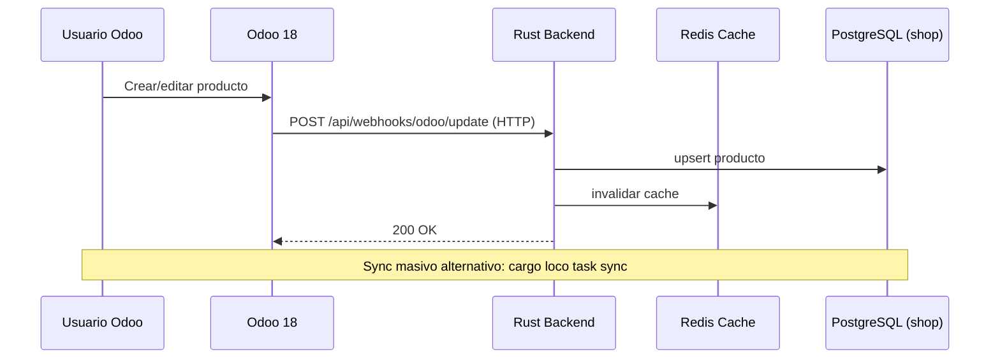
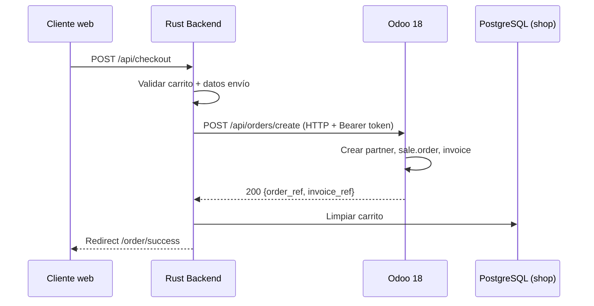

# Architecture

## Diagram

```
Navegador ──► Rust Backend (:5150) ──► PostgreSQL (shop)
                    │
                    │  (HTTP webhook + sync directo DB)
                    ▼
               Odoo 18 (:8069) ──► PostgreSQL (odoo)
```

## Components

### Rust Backend (Loco.rs)

Web server en Rust con Loco.rs framework (Axum). Sirve páginas HTML usando Tera templates + Vue 3, y una API JSON para integraciones.

**Persistencia**: PostgreSQL propia (tablas: productos, carritos, órdenes, usuarios, config).

**Cache**: Redis para el catálogo de productos (`products:all`) y cola de workers asíncronos (procesamiento de webhooks, sincronización).

### Odoo 18

ERP que actúa como fuente de verdad para productos y procesamiento de pedidos. El sitio web **no corre en Odoo** — solo se usa como backend de negocio.

**Addons custom**:
- `odoo_rust_sync` — webhooks de producto, endpoint de creación de pedidos, sync de métodos de pago
- `muk_web_*` — tema visual para el backend Odoo (sidebar, colores, dialogs, chatter)

### PostgreSQL

Dos bases de datos independientes:
- `odoo_shop_development` — datos del backend Rust
- `odoo_prod` — datos de Odoo (acceso directo solo para sync masivo)

### Redis

Dos usos:
- **Cache** (`cache.kind: Redis`) — catálogo de productos
- **Queue** (`queue.kind: Redis`) — workers asíncronos (webhooks, sync)

## Data Flow

### Productos (Odoo → Rust)



### Pedidos (Rust → Odoo)


